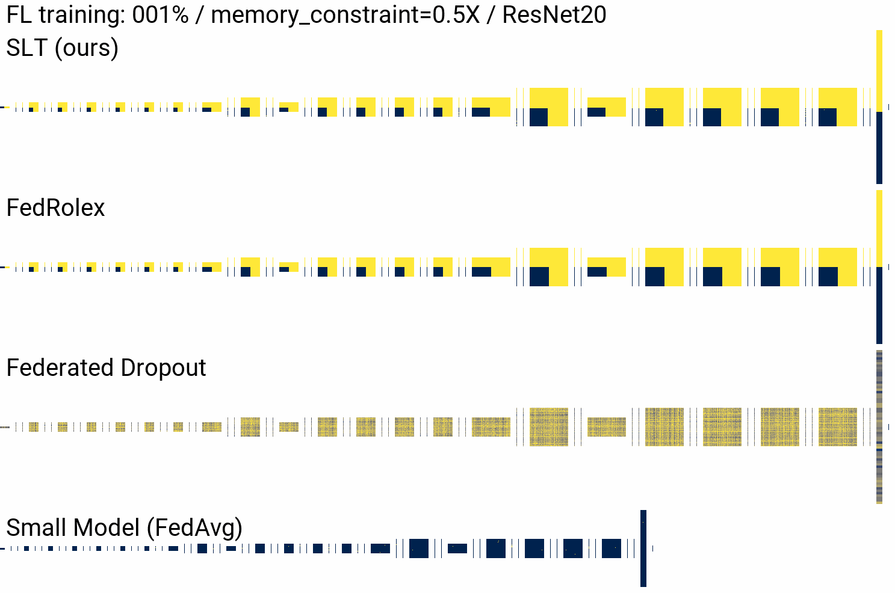

# Aggregating Capacity in FL through Successive Layer Training for Computationally-Constrained Devices

> Kilian Pfeiffer, Ramin Khalili, Jörg Henkel  
> Aggregating Capacity in FL through Successive Layer Training for Computationally-Constrained Devices  
> in Neural Information Processing Systems (NeurIPS), 2023  
> https://openreview.net/pdf?id=nXNsqB4Yr1

This repository includes the SLT code to reproduce the mainline experiments of the paper, as well as the baselines [Federated Dropout](https://arxiv.org/abs/1812.07210), [FedRolex](https://arxiv.org/abs/2212.01548), [HeteroFL](https://arxiv.org/abs/2010.01264), and [FjORD](https://arxiv.org/abs/2102.13451). The gif below visualizes the different aggregation strategies. Each pixel represents either a 3x3 kernel or a bias, scale, or a single neuron. The fully connected head is the rightmost block. Yellow (bright) indicates that the layer is not updated at all, while blue (dark) indicates that all participating devices contribute to that layer (or individual filters).  



## Installation and Dataset Preparation
* Install requirements with `python3 -m pip install -r requirements.txt`
* Datasets CIFAR-10, CIFAR-100 require no manual downloads
* For the FEMNIST experiments, it is required to download the inputs and targets from [here](https://drive.google.com/file/d/1ZFPbHddOBIkaNZcyezUuKxSSqwaHDdrE/view?usp=sharing) or [here](https://bwsyncandshare.kit.edu/s/r3R8feQRkBkCx5x/download/femnist_data.zip) and put them into the `data/femnist` folder
* TinyImageNet and ImageNet64 (downsampled resolution) have to be downloaded from https://image-net.org/download-images

## Run FL Experiments
Each run (with specific arguments) creates an folder (`run_HASH`) with a specific hash of the configuration. If a specific run is run again, the results are overridden. The experiment folder is created at `runs/{session_tag}/`. Every 25 FL rounds, plots are generated. Alternativly, plots can be generated manually using `python3 visualization/plots.py --path {PATH_TO_SESSION_TAG_FOLDER}`

```bash
usage: python3 run_fl.py [-h] [--session_tag SESSION_TAG] [--algorithm {SLT,FederatedDropout,FedAvg,FedRolex,HeteroFL,FjORD}]
               [--dataset {CIFAR10,CIFAR100,FEMNIST,TinyImageNet,ImageNet}] [--seed SEED] [--network {ResNet20,ResNet44,ResNet56,DenseNet40}]
               [--n_devices N_DEVICES] [--n_devices_per_round N_DEVICES_PER_ROUND] [--data_distribution {iid,noniid}]
               [--distribution_dirichlet_alpha DISTRIBUTION_DIRICHLET_ALPHA] [--lr LR] [--lr_reduction_factor LR_REDUCTION_FACTOR] [--weight_decay WEIGHT_DECAY]
               [--memory_constraint MEMORY_CONSTRAINT [MEMORY_CONSTRAINT ...]] [--n_rounds N_ROUNDS] [--torch_device TORCH_DEVICE] [--progress_bar PROGRESS_BAR]
               [--plot PLOT] [--data_path_prefix DATA_PATH_PREFIX] [--dry_run DRY_RUN]

```

|long|default|help|
| :--- | :--- | :--- |
|`--help`||show this help message and exit.|
|`--session_tag`|`default_session`|Sets name of subfolder for experiments.|
|`--algorithm`|`SLT`|Choice of algorithm, available options are ['SLT', 'FederatedDropout', 'FedAvg', 'FedRolex', 'HeteroFL', 'FjORD'].|
|`--dataset`|`CIFAR10`|Choice of Datasets ['CIFAR10', 'CIFAR100', 'FEMNIST', 'TinyImageNet', 'ImageNet'] (not all dataset/network combinations are possible). E.g., TinyImageNet and ImageNet64 are only compatible with ResNet44 and ResNet56.|
|`--seed`|`11`|Sets random seed for experiment.|
|`--network`|`ResNet20`|NN choice for experiement, options are ['ResNet20', 'ResNet44', 'ResNet56', 'DenseNet40'].|
|`--n_devices`|`100`|Number of total FL devices.|
|`--n_devices_per_round`|`10`|Number of FL devices active in one round.|
|`--data_distribution`|`iid`|Sets type of data distribution used in the experiment. Choices are ['iid', 'noniid']. If noniid is chosen, the rate of noniid-nes can be controled with the dirichlet alpha parameter.|
|`--distribution_dirichlet_alpha`|`0.1`|Sets the dirichlet alpha parameter for noniid data distribution (controlls the rate of noniid-nes).|
|`--lr`|`0.1`|Starting learning rate (round 0).|
|`--lr_reduction_factor`|`10.0`|Final learning rate after decay (after the chosen number of FL rounds). The total number of FL rounds influce the learning rate at a given round.|
|`--weight_decay`|`0.001`|Weight decay for SGD optimizer.|
|`--memory_constraint`|`[0.5]`| Sets the memory constraint for the experiment. For ResNet structures 0.125, 0.25, and 0.5 is available, for DenseNet 0.33 and 0.66. To have heterogeneous constraints (groups) several constraint values can be chosen.|
|`--n_rounds`|`1000`|Number of total FL rounds.|
|`--torch_device`|`cuda:0`|PyTorch device (cuda or cpu).|
|`--progress_bar`|`True`|Progress bar printed in stdout.|
|`--plot`|`True`|Plots are generated every 25 FL rounds as default behavior. Plotting can be disabled by setting it to False.|
|`--data_path_prefix`|`data/`|File location where the ML datasets are stored. Expects a trailing slash.|
|`--dry_run`|`False`|Loads the NN, datasets, but does not apply training and does not create any files.|

### Examples

Results of Figure 1.
```python
python3 run_fl.py --algorithm SLT --network ResNet20 --memory_constraint 0.125 --n_rounds 1000 --dataset CIFAR10 --n_devices 100 --n_devices_per_round 10
```

## Generating SLT configuration files

SLT configuration generator. Constraints are evaluated relative to a downscaled baseline. The final configurations are stored in `memory/configs/config__MODEL.json`.

```bash
usage: python3 memory/memory_configs_slt.py [-h] [--model {ResNet20,DenseNet,ResNet44,ResNet56}] [--subset_factor SUBSET_FACTOR] [--heterogeneous]
               [--subset_factor_strong SUBSET_FACTOR_STRONG]
```

|long|default|help|
| :--- | :--- | :--- |
|`--help`||show this help message and exit|
|`--model`|`ResNet44`|NN model to choose from (['ResNet20', 'DenseNet', 'ResNet44', 'ResNet56']).|
|`--subset_factor`|`0.125`|Subset factor to select. For ResNet structures, 0.125, 0.25, 0.5 is available, for DenseNet 0.33 and 0.66.|
|`--heterogeneous`||If set to True, a second subset factor of a strong device is evaluated, specifically, the training depth of the stronger device.|
|`--subset_factor_strong`|`0.5`|Sets the subset factor of the strong device.Choices are similar to weaker device. The subsetfactor of the strong device must be greater than the one of the weak device.|

## References
Parts of this implementation code come from the public repositories of [HeteroFL](https://github.com/diaoenmao/HeteroFL-Computation-and-Communication-Efficient-Federated-Learning-for-Heterogeneous-Clients) and [FedRolex](https://github.com/AIoT-MLSys-Lab/FedRolex).
